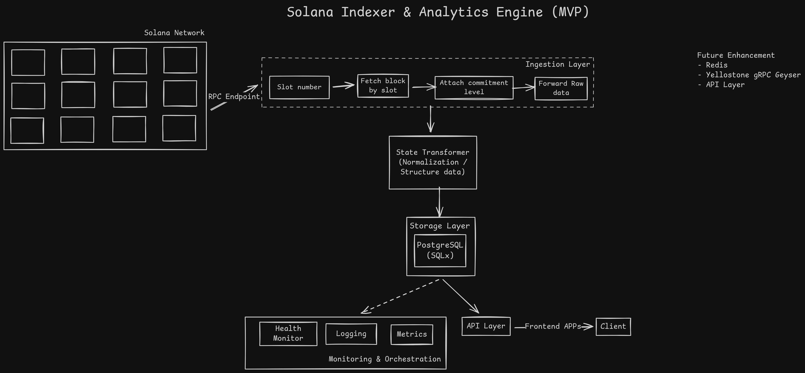

# Solana-Indexer-Rust

---

## Architecture (MVP)

---

## Scope / TODOS

### Core
- [ ] Slot-based ingestion (not tx-based)
- [ ] Historical backfill (finalized slots)
- [ ] Live ingestion (confirmed slots)
- [ ] Slot progress tracking (resume on crash)
- [ ] Idempotent inserts (replay-safe)
- [ ] Transaction indexing
- [ ] Top-level instruction indexing
- [ ] Inner instruction (CPI) indexing
- [ ] Program ID resolution
- [ ] Account key resolution
- [ ] Failed transaction handling
- [ ] Empty slot handling

### CORRECTNESS & SAFETY
- [ ] Finalized vs confirmed separation
- [ ] Reorg awareness (basic)
- [ ] Deduplication guarantees
- [ ] Deterministic ordering
- [ ] Schema constraints (natural keys)
- [ ] Graceful RPC retry logic
- [ ] Backoff & rate-limit handling

### PROGRAM AWARENESS
- [ ] SPL Token instruction decoding
- [ ] SPL Token transfer events
- [ ] Mint / burn detection
- [ ] Decimal normalization
- [ ] CPI-based token transfers

### PERFORMANCE
- [ ] Batch DB inserts
- [ ] Controlled RPC concurrency
- [ ] Memory backpressure
- [ ] Indexing lag measurement
- [ ] Slot range batching

### OBSERVABILITY
- [ ] Structured logging
- [ ] Error counters
- [ ] Latest indexed slot metric
- [ ] Lag vs cluster head
- [ ] Health check endpoint

### DATA ACCESS
- [ ] SQL analytics queries
- [ ] Read-only API layer
- [ ] Pagination support
- [ ] Filtering by program / slot / signature

### OPERATIONAL
- [ ] Configurable start slot
- [ ] Configurable RPC endpoint
- [ ] Graceful shutdown
- [ ] Restart safety
- [ ] Docker support

### FUTURE
- [ ] Geyser plugin support
- [ ] Redis cache layer

---

## Problems
- Have to structure the transactions and instruction carefully. It's 1:N not 1:1.
- Read through the data properly to understand the data (Big aha moment)
- Creating the struct is biggest point where I had to think properly and had to know the relation among txns, ins, status, CPI, fees, logs and whatnot.

---

## References
- [Helius - Understanding slots, blocks & epochs](https://www.helius.dev/blog/solana-slots-blocks-and-epochs#defining-slots-in-solana)
- [Why should we use Yellowstone gRPC Geyser](https://chainstack.com/real-time-solana-data-websocket-vs-yellowstone-grpc-geyser/)
- [Solana Accout Historical Balance Fetcher](https://github.com/e-mk/solana-account-historical-balance-fetcher)
- [Pattern Matching Deep Dive Rust](https://bytemagma.com/index.php/rust-programming/a-deeper-look-at-matching-and-patterns-in-rust)
- [Sqlx - Solana Error Resolve](https://solana.stackexchange.com/questions/10448/cannot-compile-solana-program-crate-with-new-sqlx-versions)
- [Helius - Geyser Plugin](https://www.helius.dev/blog/solana-geyser-plugins-streaming-data-at-the-speed-of-light)
- [Default Struct Rust](https://gist.github.com/ChrisWellsWood/84421854794037e760808d5d97d21421)
- [Rust Doc - Default Struct](https://doc.rust-lang.org/std/default/trait.Default.html)
- [Check this out to fetch data in more simple way - Solana Exhange](https://solana.stackexchange.com/questions/4337/working-with-the-optionserializer)
